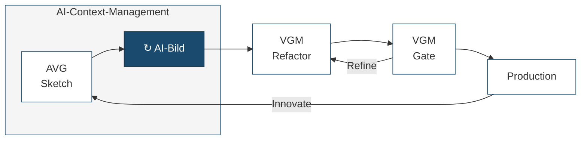

# Nächste Verbesserung: Context-Management + Phasenmodell

## Phasenmodell: Sketch → AI-Discuss & Build → Gate

pyVGM folgt einem AI-nativen Lifecycle-Modell:



| Phase | Was passiert | Wer |
|---|---|---|
| **Sketch** | Hauptanforderungen umreißen — kein Pflichtenheft, nur Kernziele und Rahmenbedingungen | Mensch + KI |
| **AI-Build** | Iterativer Discuss-Build-Zyklus: mit KI diskutieren, bauen, prüfen, verfeinern — so lange bis der fachliche Stand stimmt. Architektur wächst emergent aus dem Dialog. | Mensch + KI |
| **Refactor** | Code-Hygiene, Architektur-Alignment, technische Schulden abbauen, EA-Konformität herstellen | VGM-Framework + KI |
| **Gate** | Compliance-Prüfung, formale Dokumentation aus dem Ist-Stand generieren — regulatorische Vorgaben. Nicht bestanden → zurück in Refactor. | VGM-Framework + KI |
| **Production** | Deployment, Betrieb | Betrieb |

**Zwei Loops:**
- **Gate → Refactor**: Gate nicht bestanden — technisch nachbessern, bis die Vorgaben erfüllt sind.
- **Production → Sketch** (Innovate): Neuer fachlicher Zyklus — frischer Sketch, losgelöst vom vorherigen.

**Context-Management:** Überwacht den gesamten Bereich von Sketch bis Gate. Erinnert an Checkpoints, sichert den Stand, ermöglicht saubere Kontextwechsel zwischen Sessions. Im Gate selbst nicht nötig — dort sind die Prüf-Skills (`/pyVGM-code-quality`, `/pyVGM-security-check` etc.) die Kontrollinstanz.

**Einordnung:** Spec-First AI Development mit Compliance Gate. Methodenneutral — ergänzt sowohl klassische (V-Modell) als auch agile (Scrum) Vorgehensweisen. Jeder Durchlauf liefert einen produktionsreifen, geprüften Stand.

---

## Context-Management

Leichtgewichtige Lösung für Context Rot und Crash Recovery — ohne externes CLI, vollständig innerhalb von Claude Code mit Hooks und Skills.

## Problem

| Problem | Auswirkung |
|---|---|
| **Context Rot** | Qualität sinkt, je länger eine Session dauert |
| **Crash / Abbruch** | Kontext und Zwischenstand gehen verloren |
| **Vergessene Commits** | Arbeit nicht gesichert, kein Rollback möglich |
| **Wissensverlust zwischen Sessions** | Neue Session kennt den Fortschritt nicht |

## Lösung: 3 Bausteine

### 1. State-File (`.Vorgehensmodell/build/STATE.md`)

Persistenter Zustand, der Crashes und Kontextwechsel überlebt.

```markdown
---
last-checkpoint: 2026-04-05T14:30:00
iteration: 3
current-task: "Login-Flow implementieren"
next-steps:
  - Session-Handling testen
  - Error-States bauen
open-decisions:
  - OAuth vs. eigene Auth?
---

## Zusammenfassung

Login-Blueprint steht, Templates für Login/Register fertig.
Noch offen: Session-Handling und Fehlerseiten.
```

### 2. Hooks

**SessionStart-Hook** — prüft beim Start, ob unfertige Arbeit existiert:

```jsonc
{
  "event": "on_session_start",
  "command": "bash scripts/session-check.sh"
  // Liest STATE.md → gibt Resume-Kontext an Claude zurück
  // Kein STATE.md → "Frische Session, kein alter Stand"
}
```

**Activity-Monitor-Hook** — Wachhund, der Tool-Calls zählt:

```jsonc
{
  "event": "post_tool_call",
  "command": "bash scripts/activity-monitor.sh"
  // Zählt Tool-Calls in Temp-Datei hoch
  // Ab ~80 Calls: Warnung "Kontext wird voll, /pyVGM-checkpoint empfohlen"
  // Ab ~120 Calls: Dringende Warnung
}
```

**Was Hooks können und was nicht:**

| Kann ein Hook | Kann ein Hook nicht |
|---|---|
| Shell-Command bei Events ausführen | Kontext-Fenstergröße direkt messen |
| Dateien lesen/schreiben | In die Claude-Konversation eingreifen |
| Stdout als Hinweis an Claude zurückgeben | Die Session beenden oder neu starten |
| Tool-Calls zählen (via Temp-Datei) | Token-Verbrauch messen |

Der Schwellwert (~80 Tool-Calls) ist ein Proxy für Kontextauslastung — nicht perfekt, aber in der Praxis ausreichend.

### 3. Skills

**`/pyVGM-checkpoint`** — Sichert den aktuellen Stand:

1. Liest offene Tasks und letzte Änderungen
2. Schreibt/aktualisiert `STATE.md` mit Kontext für die nächste Session
3. Committet alles (`git add` + `commit`)
4. Gibt einen **Resume-Prompt** aus, den man in eine neue Session pasten kann

**`/pyVGM-resume`** — Stellt den Kontext aus STATE.md wieder her:

1. Liest STATE.md
2. Liest relevante Dateien (letzte Änderungen, offene Tasks)
3. Fasst den Stand zusammen und schlägt nächste Schritte vor

## Flow

```
Session 1:
  Start → Hook: "Frische Session, kein alter Stand"
  ... arbeiten ...
  ~80 Tool-Calls → Hook: "Kontext wird voll, /pyVGM-checkpoint empfohlen"
  User: /pyVGM-checkpoint
  → STATE.md geschrieben, alles committet
  → "Starte neue Session mit: /pyVGM-resume"

Session 2:
  Start → Hook liest STATE.md
  → "Iteration 3, Login-Flow. Nächste Schritte: ..."
  ... weiterarbeiten ...
  ~80 Tool-Calls → Hook erinnert erneut
  ... Zyklus wiederholt sich ...
```

## Was das löst

| Problem | Lösung |
|---|---|
| **Context Rot** | Rechtzeitige Erinnerung + sauberer Neustart |
| **Crash Recovery** | STATE.md überlebt alles |
| **Wissensverlust** | Resume-Prompt enthält den vollen Kontext |
| **Vergessene Commits** | Checkpoint committet automatisch |

## Design-Prinzipien

- **Kein externes CLI** — alles innerhalb von Claude Code (Hooks + Skills)
- **Kein neues Tool lernen** — gewohnte Slash-Commands
- **Unaufdringlich** — erinnert, zwingt nicht
- **Dateibasiert** — STATE.md ist lesbar, editierbar, versioniert
- **Einfach erweiterbar** — Schwellwerte, State-Format, Hooks sind anpassbar
