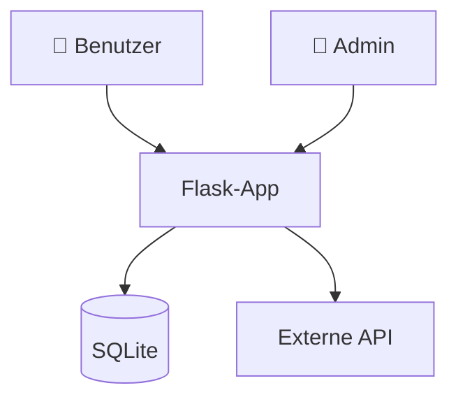
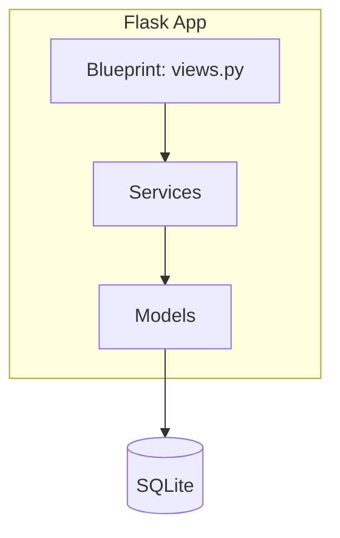

# Architektur-Dokumentation

Generiert eine arc42-artige Architekturdokumentation mit Mermaid-Diagrammen.

## Inhalt

### 1. Kontextdiagramm

Mermaid-Diagramm das zeigt:
- Das System (zentral)
- Externe Akteure (Benutzer, Admins)
- Externe Systeme (Datenbanken, APIs, Services)
- Datenflüsse zwischen allen Komponenten

### 2. Komponentendiagramm

Mermaid-Diagramm der internen Architektur:
- Flask-Blueprints
- Service-Schicht
- Models / Datenbank
- Templates / Frontend
- Hintergrund-Worker (falls vorhanden)

### 3. Deployment-Diagramm

Mermaid-Diagramm das zeigt:
- Build-Pipeline (lokal → Docker Image)
- Container-Architektur
- Netzwerk / Ports
- Volumes / Persistenz

### 4. Tech-Stack-Tabelle

Aus `pyproject.toml` und Dockerfile extrahieren:

| Schicht | Technologie | Version |
|---------|------------|---------|
| Runtime | Python | 3.11 |
| Framework | Flask | 3.x |
| ORM | SQLAlchemy | 2.x |
| Server | Gunicorn | 23.x |
| Frontend | Bootstrap | 5.3 |

## Ausgabe

Schreibe das Dokument nach `.Vorgehensmodell/dokumentation/02-architektur.md`.

## Regeln

- Nur aus dem Code ableiten — nichts erfinden
- Mermaid-Syntax prüfen (muss renderbar sein)
- Alle Blueprints und Services auflisten
- Datenflüsse zwischen Komponenten zeigen
