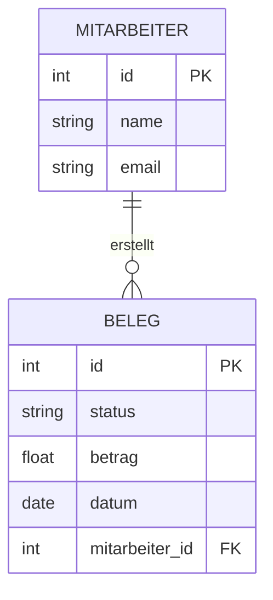
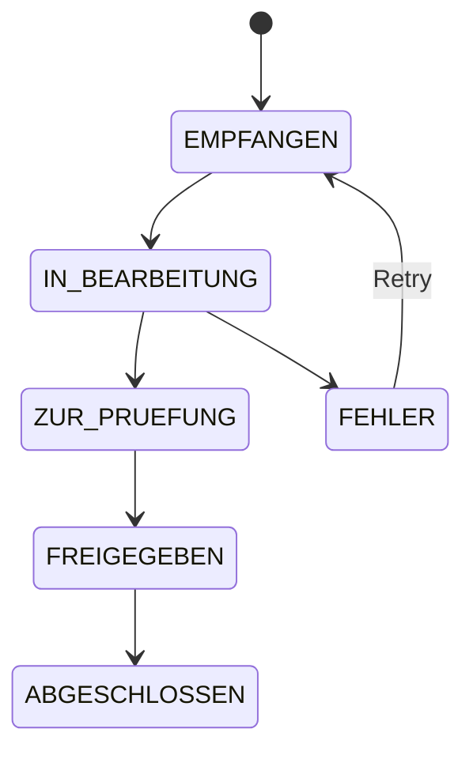

# Datenmodell-Dokumentation

Generiert eine vollständige Datenmodell-Dokumentation aus SQLAlchemy-Models.

## Inhalt

### 1. ER-Diagramm

Mermaid erDiagram mit allen Models und ihren Beziehungen:



### 2. Model-Steckbriefe

Für jedes SQLAlchemy-Model:

| Feld | Typ | Pflicht | Beschreibung |
|------|-----|---------|-------------|
| id | Integer (PK) | Ja | Primärschlüssel |
| status | String(20) | Ja | Aktueller Status |
| betrag | Float | Ja | Betrag in EUR |
| datum | Date | Ja | Belegdatum |
| erstellt_am | DateTime | Ja | Erstellungszeitpunkt |

### 3. Status-Diagramme

Für Models mit Status-Feld ein Mermaid stateDiagram:



### 4. Datenvolumen-Metriken

Falls die DB existiert:
```bash
sqlite3 data/app.db "SELECT name, COUNT(*) FROM sqlite_master WHERE type='table' GROUP BY name"
```

## Ausgabe

Schreibe nach `.Vorgehensmodell/dokumentation/03-datenmodell.md`.

## Regeln

- Alle Felder aus den SQLAlchemy-Models extrahieren (nicht raten)
- Beziehungen aus `ForeignKey` und `relationship()` ableiten
- Status-Werte aus Enums oder Konstanten lesen
- JSON-Felder: Struktur dokumentieren wenn erkennbar
