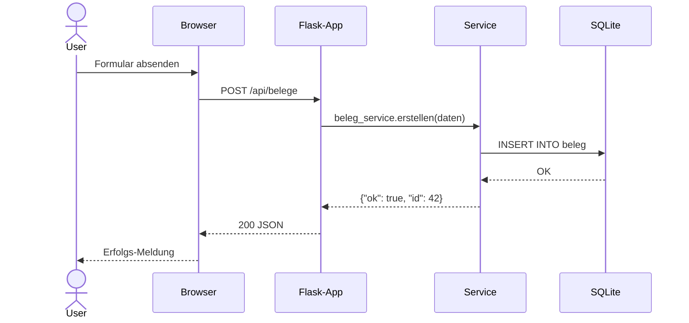

# Sequenzdiagramme

Erstellt Mermaid-Sequenzdiagramme für die wichtigsten Abläufe der Anwendung.

## Vorgehen

### 1. Abläufe identifizieren

Analysiere den Code und identifiziere die wichtigsten Abläufe:
- Benutzer-Interaktionen (Formular absenden, Button klicken)
- Hintergrundprozesse (Worker, Cron-Jobs)
- Externe Kommunikation (API-Calls, Datei-Import)
- Fehlerbehandlung (Retry, Fallback)

### 2. Diagramme erstellen

Für jeden Ablauf ein Mermaid-Sequenzdiagramm:

### 3. Typische Diagramme

Je nach Anwendung:
- **CRUD-Ablauf:** Erstellen/Lesen/Aktualisieren/Löschen
- **Authentifizierung:** Login → Session → Logout
- **Hintergrundverarbeitung:** Eingang → Worker → Ergebnis
- **API-Integration:** App → Externe API → Verarbeitung → Antwort
- **Fehlerfall:** Request → Fehler → Retry/Fallback

## Ausgabe

Schreibe nach `.Vorgehensmodell/dokumentation/06-sequenzdiagramme.md`.

## Regeln

- Nur reale Abläufe aus dem Code — nichts erfinden
- Alle beteiligten Komponenten als Participants
- Fehler-/Alternativpfade mit `alt`/`opt` darstellen
- Max. 5-8 Diagramme (die wichtigsten Abläufe)
