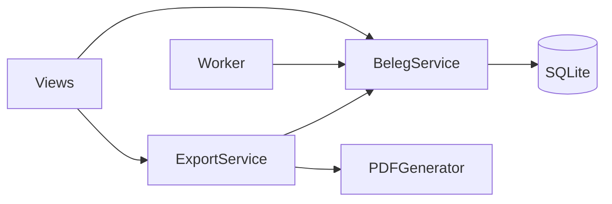

# Service- & Blueprint-Dokumentation

Erstellt Steckbriefe für alle Blueprints und Services im Projekt.

## Inhalt

### 1. Blueprint-Übersicht

Für jeden Flask-Blueprint:

| Feld | Beschreibung |
|------|-------------|
| Name | Blueprint-Name |
| Datei | Dateipfad |
| URL-Prefix | z.B. `/api`, `/admin` |
| Routes | Anzahl Endpunkte |
| Abhängigkeiten | Welche Services werden verwendet? |

### 2. Service-Steckbriefe

Für jeden Service (Klasse oder Modul in `services/`):

| Feld | Beschreibung |
|------|-------------|
| Name | Klassen-/Modulname |
| Datei | Dateipfad + Zeilennummer |
| Verantwortung | Was macht dieser Service? (1-2 Sätze) |
| Öffentliche Methoden | Name, Parameter, Rückgabetyp |
| Abhängigkeiten | DB, externe APIs, andere Services |
| Aufrufer | Welche Routes/Worker verwenden den Service? |

### 3. Abhängigkeitsdiagramm

Mermaid-Diagramm der Service-Abhängigkeiten:

### 4. API-Endpunkt-Tabelle

Alle Routen aus allen Blueprints:

| Methode | Pfad | Blueprint | Beschreibung |
|---------|------|-----------|-------------|
| GET | `/api/health` | app_bp | Health-Check |
| GET | `/manifest` | app_bp | App-Metadaten |
| POST | `/api/belege` | app_bp | Neuen Beleg anlegen |

## Ausgabe

Schreibe nach `.Vorgehensmodell/dokumentation/04-services.md`.

## Regeln

- Alle öffentlichen Methoden dokumentieren (Name + Signatur)
- Private Methoden (`_prefix`) nur erwähnen wenn sie komplex sind
- Dependencies aus Imports ableiten, nicht raten
